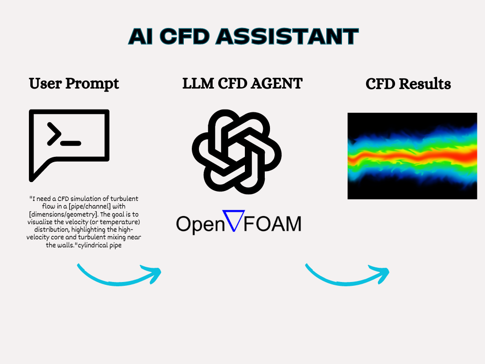

# AI CFD Assistant

## Project Overview

The AI CFD Assistant is an open-source project aimed at developing a Computational Fluid Dynamics (CFD) assistant powered by large language models. This assistant is designed to facilitate the creation of basic CFD simulation setups, with a focus on working with open-source CFD software like OpenFOAM.

Our goal is to make CFD simulations more accessible and user-friendly, particularly for those who may not have extensive experience in the field. By integrating this AI assistant into their workflow, users can streamline the process of setting up simulations, enhancing both efficiency and accuracy.

As illustrated in the image above, the AI CFD Assistant workflow involves:
1. User input through prompts
2. Processing by the LLM CFD Agent (integrated with OpenFOAM)
3. Generation of CFD results

## Proposed Features

1. Geometry Creation from Text
2. Mesh Generation
3. Boundary Condition Specification
4. Simulation Setup and Run (using OpenFOAM)
5. Image to Mesh Conversion
6. Results Processing
7. Error Handling

## Technical Setup

The LLM system consists of several agents, each performing a specific role:

- Coordinator Agent
- Geometry/Mesh Agent
- Boundary Condition Agent
- Solver Setup Agent
- Command Agent
- Python Agent (Non-LLM)

## Getting Started

(This section will be updated as development progresses)

## Contributing

We welcome contributions to the AI CFD Assistant project! 

## License

(To be determined)

## Contact

Please contact me at via [mail](mailto:eloghosaefficiency@gmail.com)
